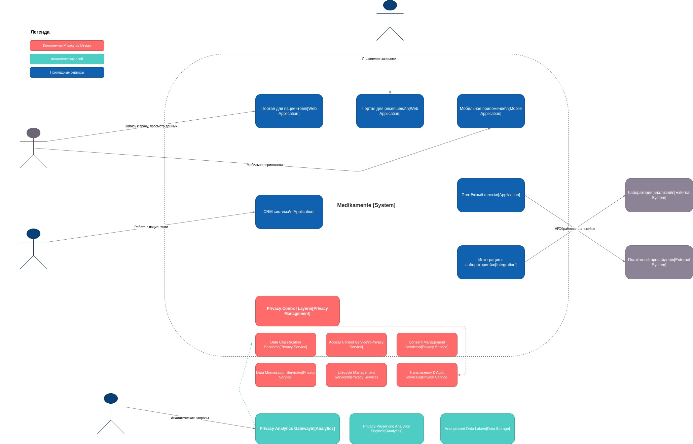

# Задание 2. Проектирование решения с использованием Privacy by Design

## 1. Анализ текущего состояния (As-Is)

Текущая архитектура компании «Медикаменте» характеризуется следующими проблемами:

- **Отсутствие централизованного управления приватностью**: данные разрознены по Excel, PDF, файловым системам.
- **Недостаточная защита персональных данных**: нет шифрования, аудита, RBAC/ABAC.
- **Нарушение требований ФЗ-152 и ФЗ-323**: хранение медицинской тайны без должного контроля доступа.
- **Отсутствие жизненного цикла данных**: данные не удаляются, не архивируются, не отслеживаются DSAR-запросы.
- **Ручные процессы**: высок риск человеческой ошибки и утечек.
- **Отсутствие аналитики с приватностью**: любые BI/ML-процессы ведут к раскрытию персональных данных.

---

## 2. Предлагаемые блоки архитектуры: Privacy by Design Layer

Для устранения указанных рисков и реализации требований To-Be предлагается выделить **специализированный слой управления приватностью**, встроенный в архитектуру на уровне C4-контейнеров.

### 2.1. Privacy Control Layer (PCL)

- **Функция**: центральный оркестратор политик приватности.
- **Ответственность**: валидация всех операций (чтение, запись, передача) на соответствие политикам, согласиям, классификации.
- **Интеграция**: все пользователи и сервисы проходят через PCL.

### 2.2. Data Classification Service (DCS)

- **Функция**: автоматическая классификация и тегирование данных.
- **Теги**: `PII`, `PHI`, `FINANCIAL`, `CONFIDENTIAL`, `INTERNAL`, `PUBLIC`.
- **Цели**: определение требований к шифрованию, доступу, хранению, анонимизации.

### 2.3. Access Control Service (ACS)

- **Функция**: RBAC + ABAC.
- **Пример правил**:
    - Врач → доступ только к своим `PHI`-данным.
    - Ресепшен → только `PII` + `OPERATIONAL`.
    - Аналитик → только анонимизированные данные.

### 2.4. Consent Management Service (CMS)

- **Функция**: хранение и проверка согласий пациента.
- **Соответствие**: ФЗ-152, DSAR-запросы (удаление, выгрузка, отзыв согласия).

### 2.5. Data Minimization Service (DMS)

- **Функция**: сокращение объёма собираемых и обрабатываемых данных.
- **Для аналитики**: применяет `k-anonymity`, `differential privacy`, `pseudonymization`.

### 2.6. Data Lifecycle Management Service (DLMS)

- **Функция**: автоматическое удаление, архивация, шифрованное хранение.
- **Политики**: сроки хранения на основе типа данных и законодательства.

### 2.7. Transparency & Audit Service (TAAS)

- **Функция**: полный аудит всех операций с `PII` и `PHI`.
- **Мониторинг**: выявление аномалий (SIEM + ML), уведомления по нетипичным действиям.

---

## 3. Аналитический слой с Privacy by Design

Чтобы компания могла использовать данные для BI, ML и AI без нарушения приватности, требуется выделить **аналитический слой с гарантиями конфиденциальности**.

### 3.1. Структура слоя

```
Privacy Analytics Gateway → Query Validator → Data Anonymizer → 
→ Privacy-Preserving Analytics Engine → Anonymized Data Lake
```

### 3.2. Ключевые компоненты

| Компонент | Назначение |
|----------|------------|
| **Privacy Analytics Gateway** | Единая точка входа для аналитиков; все запросы проходят через PCL. |
| **Query Validator** | Блокирует опасные запросы (например, `SELECT *`, `WHERE id =`). |
| **Data Anonymizer** | Применяет `k-anonymity`, `differential privacy`, `l-diversity`. |
| **Privacy-Preserving Analytics Engine** | Работает только с обезличенными данными (ClickHouse, Spark). |
| **Anonymized Data Lake** | Хранилище обезличенных данных в форматах Parquet/ORC. |

### 3.3. Примеры корректных запросов

```sql
-- ✅ Корректно: агрегация, группа ≥5, только категоризированные данные
SELECT age_group, diagnosis_category, AVG(treatment_duration)
FROM anonymized_patients
WHERE diagnosis_category = 'cardiovascular'
GROUP BY age_group, diagnosis_category
HAVING COUNT(*) >= 5;
```

```sql
-- ❌ Запрещено: доступ к индивидуальным данным
SELECT fio, birth_date FROM patients WHERE id = '123';
```

---

### Улучшения:

1. **Явно выделен Privacy Control Layer** как центральный компонент.
2. **Добавлен Privacy Analytics Gateway** как обязательная точка входа для аналитики.
3. **Улучшена модульность**: каждый сервис имеет чёткую ответственность.
4. **Усилены гарантии для аналитики**: не только анонимизация, но и запрет опасных запросов.
5. **Добавлены DSAR-механизмы**: удаление по запросу, экспортирование данных.

---

## 5. Итоговая C4 Context Diagram (To-Be)
Ниже — текст диаграммы C4 Context в формате draw.io XML. Все компоненты Privacy by Design выделены **красным**, аналитический слой — **бирюзовым**, прикладные сервисы — **синим**.



---

## 6. Соответствие требованиям

| Требование | Обеспечено компонентом |
|-----------|------------------------|
| **Data Minimization** | Data Minimization Service |
| **Purpose Limitation** | Consent Management + PCL |
| **Storage Limitation** | Lifecycle Management Service |
| **Access Control** | Access Control Service (ABAC) |
| **Encryption** | Уровень приложения + TLS |
| **User Rights** | Consent Management + DSAR API |
| **Audit & Monitoring** | Transparency & Audit Service |
| **Analytics with Privacy** | Privacy Analytics Gateway + Anonymized Data Lake |

---

Предложенная архитектура **полностью удовлетворяет требованиям**:
- ФЗ-152 (ПДн), ФЗ-323 (медицинская тайна)
- Принципам Privacy by Design
- Целям бизнеса: масштабируемость, аналитика, безопасность
