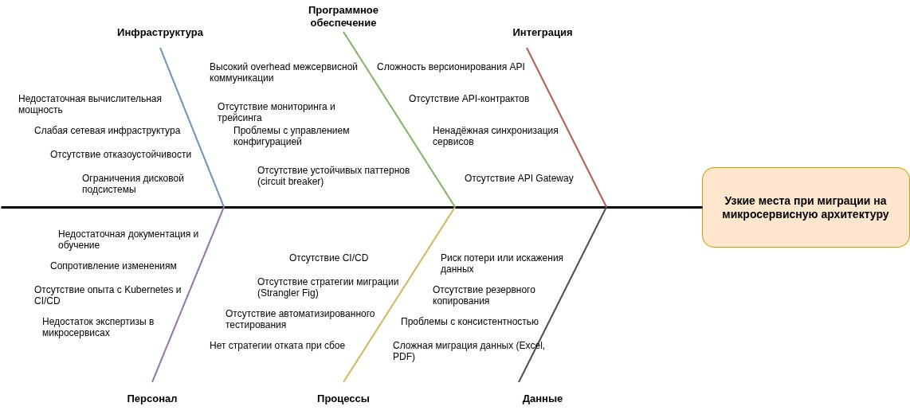

# Задание 4. Оценка узких мест при миграции

## 1. Анализ текущей ситуации и целей миграции

### 1.1. Текущее состояние (As-Is)

Компания «Медикаменте» использует монолитную архитектуру, включающую:
- Физический сервер на базе **Windows Server 2022** с локальными службами (AD, DNS, DHCP, Exchange).
- Приложения **1С:Бухгалтерия** и **1С:Торговля и склад** в **файловом режиме**.
- Хранение данных пациентов в **файлах Excel, PDF, JPG** на общем файловом сервере.
- Интеграция ККМ через **OLE и TCP/IP без шифрования**.
- Отсутствие API, CI/CD, мониторинга и автоматизации.

### 1.2. Целевое состояние (To-Be)

Цели миграции:
- Переход на **микросервисную архитектуру** на базе **Kubernetes**.
- Внедрение **единой системы управления данными** (CRM, порталы, мобильное приложение).
- Интеграция с лабораторией через **REST API + OAuth2**.
- Соответствие требованиям **ФЗ-152 и ФЗ-323**.
- Поддержка **пятикратного роста** масштаба бизнеса.
- Разделение данных на **операционные** и **аналитические** потоки.

---

## 2. Диаграмма Исикавы («Рыбья кость»)

Центральная проблема: **Узкие места при миграции монолитной системы на микросервисную архитектуру**.

Категории причин:

- **Инфраструктура**
- **Программное обеспечение**
- **Интеграция**
- **Персонал**
- **Процессы**
- **Данные**
---

## 3. Выявленные проблемы и рекомендации

| Категория | Проблема | Рекомендация | Приоритет |
|----------|--------|-------------|----------|
| **Инфраструктура** | Недостаточная вычислительная мощность | Провести capacity planning, использовать managed Kubernetes (Yandex.Cloud/VK Cloud) | Критический |
| **Инфраструктура** | Слабая сеть | Обновить оборудование до 10 Gbps, внедрить Service Mesh (Istio) | Высокий |
| **Программное обеспечение** | Отсутствие мониторинга | Развернуть стек ELK + Prometheus/Grafana + Jaeger | Высокий |
| **Программное обеспечение** | Нет устойчивых паттернов | Внедрить circuit breaker (Resilience4j), retry, timeout | Высокий |
| **Интеграция** | Нет API-контрактов | Использовать OpenAPI, Pact для contract testing | Высокий |
| **Интеграция** | Отсутствие API Gateway | Внедрить Kong или Traefik с mTLS и rate limiting | Высокий |
| **Персонал** | Недостаток экспертизы | Провести обучение, привлечь менторов, сертифицировать команду (CKA) | Высокий |
| **Персонал** | Сопротивление изменениям | Внедрить change management, вовлекать команду в проектирование | Средний |
| **Процессы** | Нет стратегии миграции | Использовать паттерн **Strangler Fig**, постепенно заменяя функции | Критический |
| **Процессы** | Отсутствие CI/CD | Настроить GitLab CI с автоматическим тестированием и canary-деплоем | Высокий |
| **Данные** | Сложная миграция Excel/PDF | Разработать ETL-инструмент с валидацией и логированием | Критический |
| **Данные** | Отсутствие резервного копирования | Настроить Velero + restic с шифрованием и регулярными DR-тестами | Высокий |

---

## 4. Приоритизация мер

### **Критический приоритет (выполнить до начала миграции)**
1. Разработка и тестирование стратегии миграции данных (ETL + валидация).
2. Capacity planning и подготовка инфраструктуры (Kubernetes, сеть).
3. Внедрение стратегии Strangler Fig для поэтапной замены функций.

### **Высокий приоритет (в течение 1–2 месяцев)**
- Настройка CI/CD + автоматизированного тестирования.
- Развертывание мониторинга (логи, метрики, трейсы).
- Обучение команды Kubernetes и микросервисам.
- Внедрение API Gateway и Service Mesh.

### **Средний приоритет (в течение 3–6 месяцев)**
- Управление изменениями и документация.
- Автоматизация отката и disaster recovery.
- Оптимизация производительности (кэширование, индексы).

---

## 5. Заключение

Миграция «Медикаменте» на микросервисную архитектуру сопряжена с **системными рисками**, которые требуют:
- **Чёткого технического планирования** (инфраструктура, данные, интеграции),
- **Организационной готовности** (обучение, поддержка изменений),
- **Процессной зрелости** (CI/CD, тестирование, мониторинг).

Без устранения выявленных узких мест существует высокий риск **сбоев**, **потери данных** и **неудовлетворённости клиентов**.

